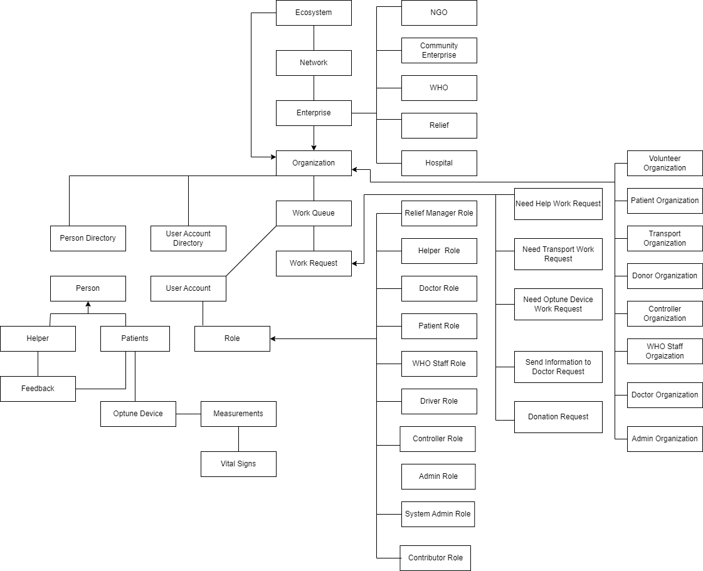
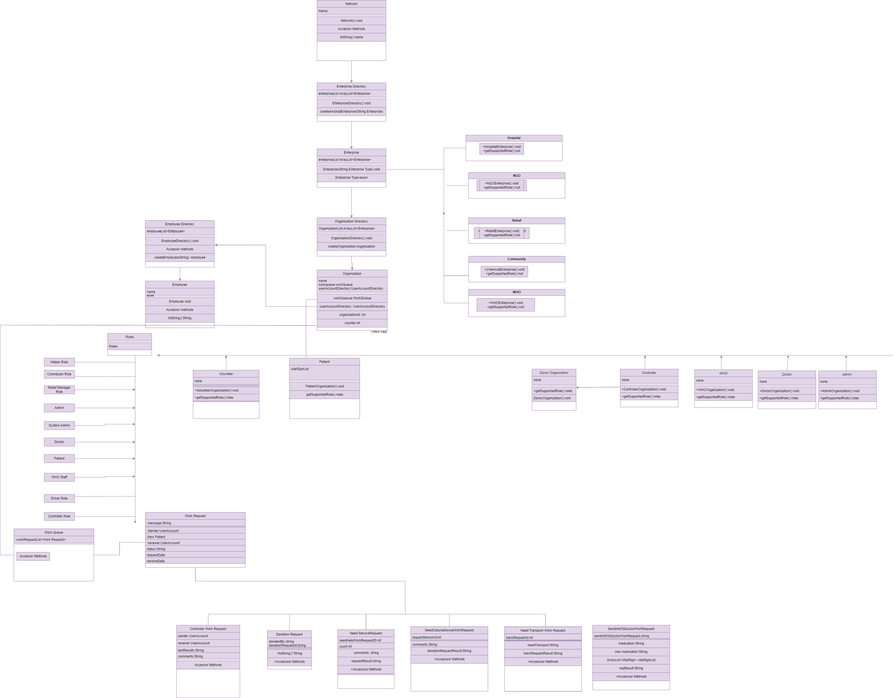
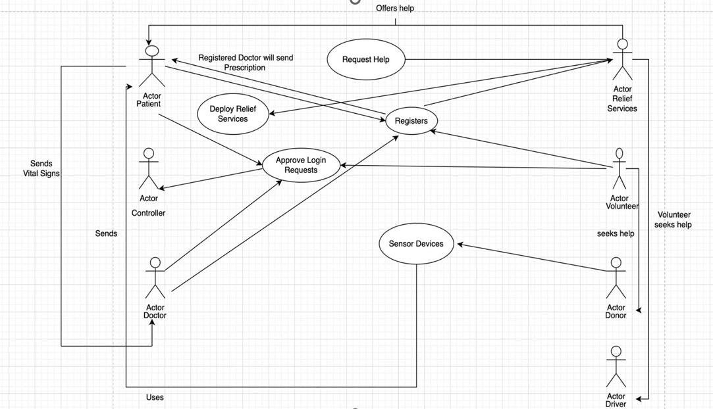

# AEDProjectFinalFall2022
# Project Name: RELIEF

## Problem Statement:
As many people today are facing health issue which are often ignored to later become a serious disease.
People who have suffered from brain tumours are often seen to be disregarding their early symptoms such as change in oxygen level,frequent headaches and difficulty with balance.
Huge expenses  for medical bills and other miscellaneous expenses  have also made brain tumor patients difficult to hire a help.

## Description:
Relief is a user friendly application which connects a patient, volunteer,doctors and NGOs.
Volunteers are the people from the community who are going to help the patients with all the physical activities.
They monitor the patients using a device and send alert messages to them.
Doctors can then check the patient’s data through this application and write a prescription.
Donors can use the application to make donations.

## Features:
Login and Register Functionality 
Email Notification to users. 
Search functionality for networks. 
CRUD Operations 
Visualization/Analysis 
User friendly and easy application. 
Authentication 
SMS for Notification 

## Heirarchy Diagram:

## Class Diagram:

## UseCase Diagram:

## Steps to Run this Project:
- Clone or download zip file from this repository. 
- Open the Project in Netbeans. 
- Include all the jar files 
- Right click on project and then run it. 

## Team Members:
Shreya Baliga --> 002795178 --> baliga.s@northeastern.edu  
Shivani Sahu  --> 002737279 --> sahu.shi@northeastern.edu  
Anuja Patil   --> 002797645 --> patil.anuj@northeastern.edu  
